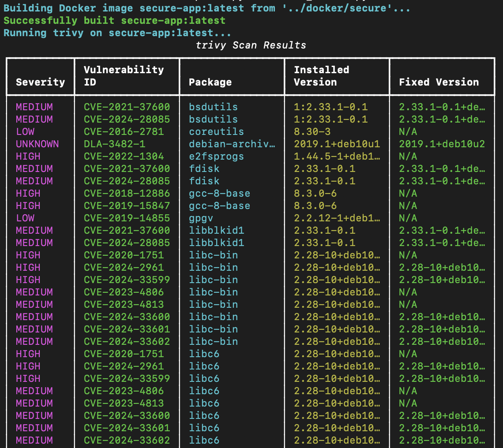

# Modular IaC Security Review Automation Project

This project is a comprehensive, hands-on demonstration of Infrastructure-as-Code (IaC) and container security practices. It showcases the ability to automate the detection and remediation of security vulnerabilities in AWS environments using Terraform and Docker. The core of the project is a set of modular Python scripts that orchestrate popular open-source security tools (`tfsec`, `checkov`, `trivy`, `dockle`) to create a practical IaC security pipeline.

## Project Purpose & Key Features

This portfolio piece is designed to demonstrate in-demand cybersecurity skills, including:
- **Automated Security Scanning:** Python scripts automate the entire process of scanning and parsing results.
- **IaC Static Analysis:** Identification of misconfigurations in Terraform code before deployment.
- **Container Image Security:** Analysis of Dockerfiles and images for known vulnerabilities (CVEs) and best-practice violations.
- **Vulnerability Management:** Clear "before and after" demonstration of identifying, analyzing, and remediating security flaws.
- **Modular & Extensible Design:** Code is organized into reusable functions, making it easy to add more scanners or targets.
- **Command-Line Usability:** Scripts are built as flexible command-line tools that can be pointed at any directory.

---

## Tools & Technologies

| Technology | Role |
| :--- | :--- |
| **Python** | Orchestration, automation, and parsing of scan results. |
| **Terraform** | IaC tool used to define AWS resources with intentional vulnerabilities. |
| **Docker** | Used to build container images with common security anti-patterns. |
| **AWS** | The target cloud environment for the IaC configurations (S3, IAM, EC2). |
| **tfsec** | A static analysis scanner for finding security misconfigurations in Terraform. |
| **Checkov** | A policy-as-code tool for finding misconfigurations across IaC frameworks. |
| **Trivy** | A comprehensive vulnerability scanner for container images. |
| **Dockle** | A container image linter that checks for Dockerfile best-practice violations. |
| **Rich (Python Lib)** | Used to generate clean, readable tables for the terminal output. |

---

## How It Works

The project workflow is straightforward:
1.  **Define Infrastructure:** An `insecure` version of the Terraform and Docker code is created with common, high-impact vulnerabilities.
2.  **Automated Scanning:** The Python scripts are executed, which call the underlying security tools (tfsec, trivy, etc.) against the target code.
3.  **Parsing & Reporting:** The scripts capture the JSON output from the tools and parse it into a human-readable summary table, highlighting the severity, affected resource, and remediation advice.
4.  **Remediation:** A `secure` version of the code is provided where all identified issues have been fixed according to security best practices.
5.  **Verification:** The scripts are run again against the `secure` code to verify that all vulnerabilities have been successfully remediated.

---

## Design Choices

### Why I left variables.tf and outputs.tf empty
In this project, I left variables.tf and outputs.tf empty by design. In a real-world Terraform deployment, variables.tf would make the code configurable and reusable by defining input variables, and outputs.tf would expose important information about deployed resources, like IPs or bucket names. For this educational project, I hardcoded values in main.tf and focused on static security analysis, so variables and outputs weren’t needed. This keeps the project simple and ensures the focus remains on identifying security misconfigurations.

---

## Setup and Usage

### AWS account setup
To set up my environment for this IaC project, I created a dedicated IAM user (terraform-admin) in AWS, attached the AdministratorAccess policy, and generated an Access Key ID and Secret Access Key. I then configured the AWS CLI on my local machine with these credentials so Terraform could authenticate and manage resources. In production, I would limit permissions following the principle of least privilege, but for this sandbox project, full admin access simplifies setup and prevents permission errors.

### Prerequisites
- Python 3.7+
- AWS CLI installed and configured (for Terraform to work)
- Terraform installed
- Docker installed and running

### Installation
1.  **Clone the repository:**
    ```bash
    git clone https://github.com/Dycouzt/Secure-Infrastructure-as-Code
    cd iac-security-review-project
    ```
2.  **Install Python dependencies:**
    ```bash
    pip install -r requirements.txt
    ```
3.  **Install Security Tools (macOS with Homebrew example):**
    ```bash
    brew install tfsec checkov trivy
    brew install goodwithtech/r/dockle # Latest version
    ```
    *For other operating systems, please consult the official documentation for each tool.*

### Running the Scans
The scripts are designed to be run from the root directory and pointed at the desired target folder.

**1. Scan a Terraform Directory:**
```bash
# Scan the insecure configuration
python scripts/scan_tf.py terraform/insecure

# Scan the secure (remediated) configuration
python scripts/scan_tf.py terraform/secure
```

**2. Scan a Docker Directory:**
```bash
# Build and scan the insecure Docker image
python scripts/scan_docker.py docker/insecure

# Build and scan the secure Docker image
python scripts/scan_docker.py docker/secure
```

---

## Scan Results: Before vs. After

### Terraform Security Posture

**Before:** The initial scan of the `insecure` directory immediately flags critical issues, including a publicly accessible S3 bucket, an overly permissive IAM policy (`*/*`), and an EC2 security group open to the world.


**After:** After applying remediation (e.g., setting S3 ACL to private, scoping IAM permissions, and restricting security group ports), a rescan of the `secure` directory confirms that all issues have been resolved.


### Docker Image Security

**Before:** The scan of the `insecure` image reveals multiple vulnerabilities. `Trivy` detects CVEs in the outdated base image (`python:3.7-slim`), while `Dockle` flags dangerous practices like running as the `root` user and embedding secrets in the Dockerfile.


**After:** The remediated Dockerfile uses a newer base image, implements a multi-stage build, and creates a non-root user. The rescan shows a significant reduction in vulnerabilities and an improved best-practice score.



---

## Author

Dycouzt - Diego Acosta